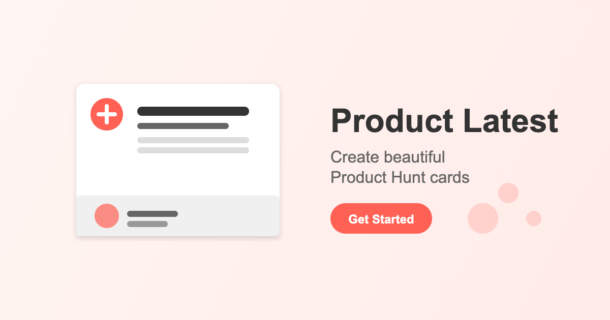

# Product Latest Deployment Guide

<div align="center">
  
  

  <h1>Deployment Guide</h1>
  
  <p>Step-by-step instructions to deploy Product Latest</p>

  <p>
    <a href="DEPLOYMENT_GUIDE.md">English</a> |
    <a href="DEPLOYMENT_GUIDE_ZH.md">中文</a>
  </p>
  
  

</div>

This guide will help you deploy the Product Hunt card generator from scratch, including both the frontend application and backend API. This tutorial is designed for beginners, and we'll explain each step in detail.

## Table of Contents
- [Prerequisites](#prerequisites)
- [Deploying the Cloudflare Worker (API)](#deploying-the-cloudflare-worker-api)
- [Deploying the Frontend to Cloudflare Pages](#deploying-the-frontend-to-cloudflare-pages)
- [Domain Settings (Optional)](#domain-settings-optional)
- [Local Development (Optional)](#local-development-optional)
- [Troubleshooting](#troubleshooting)

## Prerequisites

### 1. Create Necessary Accounts

Before starting deployment, you need to register for the following accounts:

- **GitHub Account**: [https://github.com/signup](https://github.com/signup)
- **Cloudflare Account**: [https://dash.cloudflare.com/sign-up](https://dash.cloudflare.com/sign-up)
- **Product Hunt Developer Account**: [https://api.producthunt.com/v2/oauth/applications](https://api.producthunt.com/v2/oauth/applications)

### 2. Get Product Hunt API Token

1. Log in to the [Product Hunt API Dashboard](https://api.producthunt.com/v2/docs)
2. Click "My Applications"
3. Click "Add an application"
4. Fill in the application information:
   - Name: You can enter "Product Hunt Card Generator"
   - Redirect URI: Enter your domain, e.g., `https://yourdomain.com` (if you don't have a domain yet, you can enter `https://ph-cards.pages.dev` and modify it later)
5. After creating the application, note down the following information:
   - API Key
   - API Secret
   - Developer Token

### 3. Install Necessary Software (Only for Local Development)

If you want to develop or test the project locally, you'll need to install:

- **Node.js**: [https://nodejs.org/](https://nodejs.org/) (LTS version recommended)
- **Git**: [https://git-scm.com/downloads](https://git-scm.com/downloads)

## Deploying the Cloudflare Worker (API)

Cloudflare Worker is used to proxy API requests and protect your API keys from exposure.

### 1. Log in to Cloudflare Dashboard

Visit [https://dash.cloudflare.com](https://dash.cloudflare.com) and log in to your account.

### 2. Create a Worker

1. Click on "Workers & Pages" in the left navigation bar
2. Click "Create application"
3. Select "Create Worker"
4. Give your Worker a name, e.g., "ph-api-proxy"
5. Click the "Deploy" button

### 3. Edit Worker Code

1. After the Worker is created, click "Quick edit"
2. Delete all the default code in the editor
3. Paste the following code (remember to replace `YOUR_DEVELOPER_TOKEN`):

```js
// Cloudflare Workers Proxy Script
// Used to protect API keys and solve CORS issues

addEventListener('fetch', event => {
  event.respondWith(handleRequest(event.request))
})

const PRODUCT_HUNT_API_URL = 'https://api.producthunt.com/v2/api/graphql'
const API_TOKEN = 'YOUR_DEVELOPER_TOKEN' // Replace with your Product Hunt Developer Token

// Cache time (seconds)
const CACHE_TTL = 300 // 5 minutes, reduced cache time

async function handleRequest(request) {
  // Handle preflight requests
  if (request.method === 'OPTIONS') {
    return handleCors(request)
  }

  try {
    // Ensure the request contains a JSON body
    let requestBody
    try {
      requestBody = await request.json()
    } catch (e) {
      return new Response(JSON.stringify({ error: "Invalid JSON in request" }), {
        status: 400,
        headers: corsHeaders()
      })
    }

    // Log received query and variables
    console.log('Received query:', requestBody.query)
    console.log('Received variables:', requestBody.variables)
    
    // Check if the request asks to skip cache
    const skipCache = requestBody.skipCache === true
    
    // Try to get response from cache (unless explicitly asked to skip cache)
    let cachedResponse = null
    if (!skipCache) {
      const cacheKey = getCacheKey(requestBody)
      cachedResponse = await getCachedResponse(cacheKey)
    }
    
    if (cachedResponse) {
      console.log('Returning data from cache')
      return new Response(JSON.stringify(cachedResponse), {
        headers: corsHeaders()
      })
    }

    // Send request to Product Hunt API
    const response = await fetch(PRODUCT_HUNT_API_URL, {
      method: 'POST',
      headers: {
        'Content-Type': 'application/json',
        'Authorization': `Bearer ${API_TOKEN}`,
        'Accept': 'application/json',
      },
      body: JSON.stringify({
        query: requestBody.query,
        variables: requestBody.variables
      })
    })

    // Check HTTP status
    if (!response.ok) {
      const errorText = await response.text()
      console.error('API request failed:', response.status, errorText)
      
      return new Response(JSON.stringify({
        errors: [{
          message: `API request failed (${response.status}): ${errorText}`
        }]
      }), {
        status: 502,
        headers: corsHeaders()
      })
    }

    // Get response data
    const data = await response.json()
    console.log('API response:', data)
    
    // Cache response (unless explicitly asked to skip cache)
    if (!skipCache && !data.errors) {
      const cacheKey = getCacheKey(requestBody)
      await cacheResponse(cacheKey, data)
    }

    // Return response with CORS headers
    return new Response(JSON.stringify(data), {
      headers: corsHeaders()
    })
  } catch (err) {
    console.error('Worker error:', err)
    return new Response(JSON.stringify({ 
      errors: [{ message: err.message || 'Request processing failed' }] 
    }), {
      status: 500,
      headers: corsHeaders()
    })
  }
}

function corsHeaders() {
  return {
    'Content-Type': 'application/json',
    'Access-Control-Allow-Origin': '*',
    'Access-Control-Allow-Methods': 'GET, POST, OPTIONS',
    'Access-Control-Allow-Headers': 'Content-Type, Authorization'
  }
}

function handleCors(request) {
  return new Response(null, {
    status: 204,
    headers: {
      'Access-Control-Allow-Origin': '*',
      'Access-Control-Allow-Methods': 'GET, POST, OPTIONS',
      'Access-Control-Allow-Headers': 'Content-Type, Authorization',
      'Access-Control-Max-Age': '86400'
    }
  })
}

// Generate cache key
function getCacheKey(requestBody) {
  // Simply use query and variables as cache key
  const { query, variables } = requestBody
  return `ph_api_${JSON.stringify(variables)}_${query.replace(/\s+/g, '')}`
}

// Get response from cache
async function getCachedResponse(key) {
  try {
    const cached = await caches.default.match(new Request(`https://example.com/${key}`))
    if (cached) {
      const data = await cached.json()
      return data
    }
  } catch (e) {
    console.error('Cache read error:', e)
  }
  return null
}

// Cache response
async function cacheResponse(key, data) {
  try {
    const response = new Response(JSON.stringify(data), {
      headers: {
        'Content-Type': 'application/json',
        'Cache-Control': `max-age=${CACHE_TTL}`
      }
    })
    
    await caches.default.put(new Request(`https://example.com/${key}`), response)
  } catch (e) {
    console.error('Cache write error:', e)
  }
}
```

4. Replace `YOUR_DEVELOPER_TOKEN` in the code with the Product Hunt Developer Token you obtained earlier
5. Click "Save and Deploy" to save and deploy the code
6. After successful deployment, note down your Worker URL, e.g., `https://ph-api-proxy.username.workers.dev`

## Deploying the Frontend to Cloudflare Pages

### 1. Create a GitHub Repository

1. Log in to your GitHub account
2. Click the "+" icon in the top right corner and select "New repository"
3. Fill in the repository information:
   - Repository name: e.g., "product-hunt-cards"
   - Description (optional)
   - Select "Public"
   - Check "Add a README file"
4. Click "Create repository"

### 2. Get the Project Code

There are two ways to get the project code: you can copy from an existing project or create one from scratch.

#### Method 1: Copy from an Existing Project (Recommended)

1. Clone or download all files from this project
2. Make sure the project structure is correct, including the following files and directories:
   - `src/` directory (containing all source code files)
   - `public/` directory (containing static resources)
   - `index.html`
   - `package.json`
   - `vite.config.js`
   - `tailwind.config.js`
   - `.gitignore`
   - `README.md`

#### Method 2: Create from Scratch (Requires Basic Development Knowledge)

1. Install Node.js and npm (mentioned above)
2. Create a new Vite project:
   ```bash
   npm create vite@latest product-hunt-cards -- --template react
   cd product-hunt-cards
   ```
3. Install necessary dependencies:
   ```bash
   npm install react-router-dom html-to-image axios @fortawesome/fontawesome-svg-core @fortawesome/free-solid-svg-icons @fortawesome/react-fontawesome react-colorful
   npm install -D tailwindcss postcss autoprefixer daisyui
   ```
4. Initialize TailwindCSS:
   ```bash
   npx tailwindcss init -p
   ```
5. Then you need to create all necessary components and files according to the project requirements

### 3. Upload the Project Code

Method 1: Using GitHub Desktop (Recommended for Beginners)

1. Download and install [GitHub Desktop](https://desktop.github.com/)
2. Open GitHub Desktop and log in to your GitHub account
3. Click "Clone a Repository" and select the repository you just created
4. Click "Clone"
5. Copy all files from this project to your cloned repository folder
6. In GitHub Desktop, you'll see a list of changes
7. Fill in the commit message at the bottom left, e.g., "Initial commit"
8. Click "Commit to main"
9. Click "Push origin" in the top right to upload the code

Method 2: Using the Command Line (For Experienced Users)

```bash
# Clone your empty repository
git clone https://github.com/yourusername/product-hunt-cards.git

# Enter the repository directory
cd product-hunt-cards

# Copy project files to this directory

# Add all files
git add .

# Commit changes
git commit -m "Initial commit"

# Push to remote repository
git push origin main
```

### 4. Modify the API Proxy Address

Before pushing the code, you need to modify the `src/services/productHuntApi.js` file:

1. Open the `src/services/productHuntApi.js` file
2. Find the following line of code:
   ```javascript
   const API_PROXY_URL = 'https://ancient-frost-fcff.mengchenmo.workers.dev';
   ```
3. Replace this URL with your Cloudflare Worker URL:
   ```javascript
   const API_PROXY_URL = 'https://your-worker-name.yourusername.workers.dev';
   ```
4. Save the file and commit the changes:
   ```bash
   git add src/services/productHuntApi.js
   git commit -m "Update API proxy address"
   git push origin main
   ```

### 5. Deploy the Frontend Application in Cloudflare Pages

1. Log in to the Cloudflare Dashboard
2. Click "Workers & Pages" in the left navigation bar
3. Click "Create application"
4. Select the "Pages" tab
5. Click "Connect to Git"
6. Authorize Cloudflare to access your GitHub account
7. Select the repository where you uploaded the project code
8. Click "Begin setup"
9. Fill in the deployment information:
   - Project name: e.g., "ph-cards"
   - Production branch: main
   - Build settings:
     - Build command: `npm install && npm run build`
     - Build output directory: `dist`
     - Framework preset: Vite
10. Click "Save and Deploy"

### 6. Wait for Deployment to Complete

Cloudflare Pages will automatically perform the following operations:
- Pull your code from GitHub
- Install dependencies (`npm install` or `yarn install`)
- Build the project (`npm run build` or `yarn build`)
- Deploy to CDN

After deployment is complete, you'll see a "Success" status and get a `*.pages.dev` access address.

## Domain Settings (Optional)

If you want to use your own domain instead of the `*.pages.dev` domain provided by Cloudflare:

1. Click on your Pages project in the Cloudflare Dashboard
2. Click the "Custom domains" tab
3. Click "Set up a custom domain"
4. Enter the domain you want to use (the domain needs to be already added to your Cloudflare account)
5. Click "Continue"
6. Follow the wizard to complete the setup

## Local Development (Optional)

If you want to develop and test the project locally, follow these steps:

### 1. Install Dependencies

Run the following in the project root directory:

```bash
npm install
```

### 2. Start the Development Server

```bash
npm run dev
```

This will start a local development server, usually at `http://localhost:5173` or `http://localhost:3000`.

### 3. Build the Project

When you're done developing, you can build the project:

```bash
npm run build
```

This will generate static files in the `dist` directory, which you can deploy to any static website hosting service.

### 4. Preview the Build Result

```bash
npm run preview
```

This will start a local server to preview the build result.

## Troubleshooting

### 1. Worker Deployment Failure

- **Problem**: Worker code deployment fails or reports errors
- **Solution**:
  - Ensure the Worker code syntax is correct with no extra characters
  - Confirm that the Product Hunt Developer Token is correct
  - Check if your Cloudflare account has sufficient permissions

### 2. Pages Build Failure

- **Problem**: Frontend project build fails
- **Solution**:
  - Check if the build command and output directory are correct
  - View the build logs to find the cause of the error
  - Ensure the dependency versions in `package.json` are compatible
  - Try running `npm run build` locally to troubleshoot errors first

### 3. API Call Failure

- **Problem**: Unable to get Product Hunt data
- **Solution**:
  - Confirm that the Worker URL is correct
  - Check network requests and error messages in the browser console
  - Verify if the Product Hunt Developer Token has expired
  - Check if there are error messages in the Worker logs
  - Try accessing the Worker URL directly; if it returns an error, there's an issue with the Worker configuration

### 4. Image Export Error

- **Problem**: Unable to export images or images display abnormally
- **Solution**:
  - Ensure the browser supports modern JavaScript features
  - Try reducing the export image resolution
  - If there's an issue with image background transparency, check if the export format is PNG
  - For larger images, you may need to increase the processing wait time

### 5. Frontend Style Loading Failure

- **Problem**: Page displays without styles or with layout issues
- **Solution**:
  - Confirm that TailwindCSS is correctly configured
  - Check if the build output directory contains CSS files
  - See if there are 404 errors in the browser console

## Summary

Congratulations! You should now have a fully deployed Product Hunt card generator, including:
- An API proxy hosted on Cloudflare Worker
- A frontend application hosted on Cloudflare Pages

You can access your application via your Pages URL or custom domain. If you need to update the application in the future, simply push the new code to the GitHub repository, and Cloudflare Pages will automatically rebuild and deploy.

## Frontend Application Features

After deployment, your application will provide the following features:

1. **Input Product Hunt URL**: Enter any Product Hunt product link
2. **Generate Beautiful Cards**: Automatically extract product information and generate showcase cards
3. **Customize Card Style**:
   - Choose different frame styles (clean, window, retro, etc.)
   - Select background type and color
   - Adjust shadow effects and card aspect ratio
   - Show/hide Logo, tagline, and watermark
4. **Export Settings**:
   - Choose export format (PNG, JPEG, WebP)
   - Adjust image quality (50%-100%)
   - Select resolution (1x-4x)
5. **One-Click Export**: Download beautiful product showcase cards

Enjoy using it! If you have any questions, you can refer to the troubleshooting section above or seek help from us. 