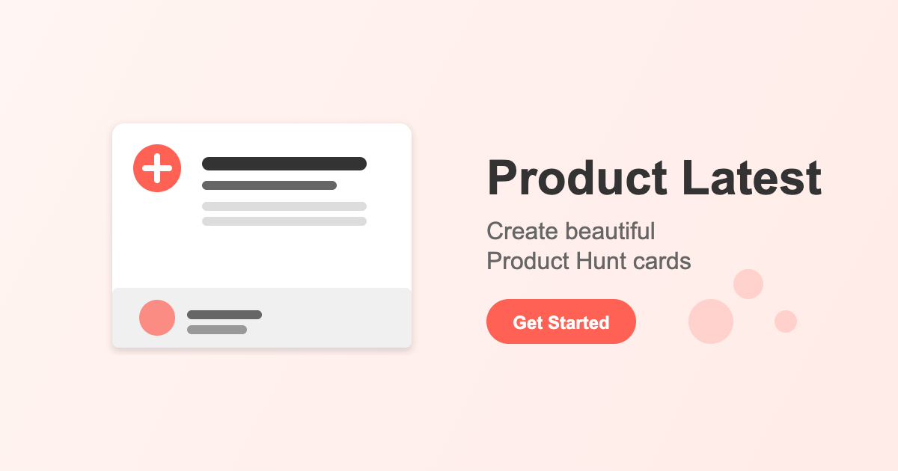

# Product Latest

<div align="center">
  
  

  <h1>Product Latest</h1>
  
  <p>Create beautiful Product Hunt cards for your products</p>

  <p>
    <a href="README.md">English</a> |
    <a href="README_ZH.md">中文</a>
  </p>
  
  

</div>

## 🌟 Features

- **Instant Card Creation**: Enter a Product Hunt URL to automatically fetch product information
- **Multiple Styles**: Choose from various frame styles, backgrounds, and shadow effects
- **Custom Themes**: Apply solid colors, gradients, and other background styles
- **Flexible Layout**: Adjust card aspect ratio and layout options
- **Content Customization**: Edit product details, logo, and tagline
- **Export Options**: Download in multiple formats (PNG, JPEG) and resolutions
- **Multilingual**: Supports both English and Chinese interfaces

## 🚀 Getting Started

### Online Usage

1. Visit [productlatest.com](https://productlatest.com)
2. Enter a Product Hunt product URL or slug
3. Customize your card with the available options
4. Click the export button to download your beautiful product card

### Local Development

```bash
# Clone the repository
git clone https://github.com/naxiaoduo/productlatest.git

# Navigate to the project directory
cd productlatest

# Install dependencies
npm install

# Start the development server
npm run dev
```

## 🛠️ Tech Stack

- **Frontend**: React + Vite
- **Styling**: TailwindCSS + DaisyUI
- **Image Generation**: html-to-image
- **Data Source**: Product Hunt API (GraphQL)
- **Deployment**: Cloudflare Pages

## 📝 License

This project is licensed under the MIT License - see the LICENSE file for details.

## 🙏 Support

If you find this tool useful, consider supporting the developer:

[](https://ko-fi.com/naxol)

